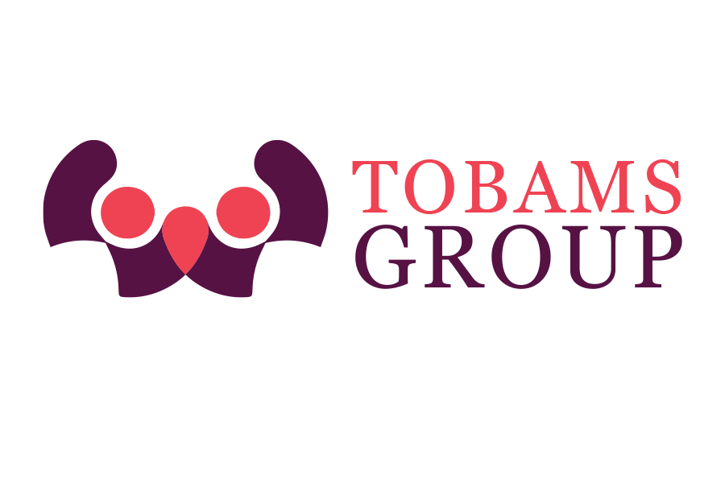
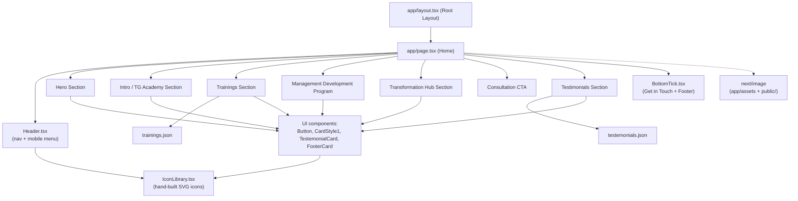

<div align="center">



# Tobams Group — Marketing Website(Frontend Accessment)

> A fast, responsive corporate landing page for Tobams Group's training, talent development, and consulting services.
</div>

---

## 📋 Table of Contents

- [About](#-about)
- [Features](#-features)
- [Tech Stack](#-tech-stack)
- [Architecture](#-architecture)
- [Project Structure](#-project-structure)
- [Getting Started](#-getting-started)
- [Available Scripts](#-available-scripts)
- [Configuration](#-configuration)
- [Contributing](#-contributing)
- [Acknowledgments](#-acknowledgments)

---

## 📖 About

This project is a **single-page marketing site** for Tobams Group. It presents the company's Learning Management System (TG Academy), training programs, the CEO-led "Transformation Hub" webinar series, and social proof via client testimonials — all wrapped in a custom brand theme.

-

There is no backend, database, or external API in this codebase: all page content (training programs and testimonials) is sourced from local JSON files, and the UI is composed from a small set of reusable React components.

---

## ✨ Features

- 🧭 **Responsive header & navigation** — Sticky nav bar with a collapsible mobile menu toggled via a hamburger icon (`app/components/layouts/Header.tsx`)
- 🎯 **Hero section** — Full-bleed background image with a primary call-to-action ("Book a Consultation")
- 🎓 **TG Academy intro** — Overview of the Learning Management System and its course catalog
- 🗂️ **Data-driven training cards** — Corporate Trainings, Personalised Individual Training, and Capacity Development cards rendered dynamically from `trainings.json`
- 👔 **Management Development Program spotlight** — Dedicated section highlighting leadership, communication, and strategic-thinking benefits
- 🎙️ **Transformation Hub webinar section** — Feature grid promoting the CEO-led webinar series
- 💬 **Testimonials** — Client feedback cards rendered dynamically from `testemonials.json`
- 📣 **Consultation CTA banners** — Repeated conversion points throughout the page
- 🦶 **Rich footer** — Site-map style link columns, contact card, social icons, and legal links
- 🎨 **Custom design system** — Brand color palette defined as Tailwind CSS v4 theme tokens (`app/globals.css`)
- 🖼️ **Hand-built SVG icon library** — No external icon package; icons live in `IconLibrary.tsx`
- ⚡ **Optimized images** — All imagery served through `next/image`

---

## 🧰 Tech Stack

**Framework & Language**


**Styling**


**Tooling**


There is no database, authentication provider, or external API integration in this codebase — content is served from local static JSON files.

---

## 🏗️ Architecture

This is a static, client-rendered marketing page built on the Next.js **App Router**. `app/page.tsx` composes the whole page from layout and UI components, pulling copy and repeatable list content from local JSON data files rather than hardcoding it inline.



**Notes**

- **No backend / database / auth** — the app has no API routes, server actions, or data-fetching from external services; all dynamic-looking content (training cards, testimonials) comes from local JSON.
- **Styling** is handled entirely through Tailwind CSS v4 utility classes, with the brand palette defined once as `@theme` tokens in `app/globals.css` and reused across components.
- **Images** are imported as local modules from `app/assets/` (content imagery) or served from `public/` (the logo), and rendered via `next/image` for automatic optimization.

---

## 📁 Project Structure

```
.
├── app/
│   ├── assets/                  # Content imagery (hero, section, testimonial photos)
│   ├── components/
│   │   ├── layouts/
│   │   │   ├── Header.tsx       # Nav bar + mobile hamburger menu
│   │   │   └── BottomTick.tsx   # "Get in touch" band + site footer
│   │   └── ui/
│   │       ├── Elements.tsx     # Shared <Button /> component
│   │       ├── Cards.tsx        # CardStyle1, TestemonialCard, FooterCard
│   │       └── IconLibrary.tsx  # Hand-built SVG icon set
│   ├── utils/data/
│   │   ├── trainings.json       # Training program content
│   │   └── testemonials.json    # Client testimonial content
│   ├── globals.css              # Tailwind import + brand color theme tokens
│   ├── layout.tsx               # Root HTML layout
│   └── page.tsx                 # Home page composition
├── public/
│   └── logo.png                 # Site logo
├── eslint.config.mjs
├── next.config.ts
├── postcss.config.mjs
├── tsconfig.json
└── package.json
```

---

## 🚀 Getting Started

### Prerequisites

- **Node.js** (a recent LTS release compatible with Next.js 16)
- **npm** (or an equivalent package manager — yarn/pnpm/bun also work, though `npm` scripts are shown below)

### Installation

```bash
# Clone the repository
git clone https://github.com/lord-Ace/Tobams.git
cd Tobams

# Install dependencies
npm install
```

### Run the development server

```bash
npm run dev
```

Open [http://localhost:3000](http://localhost:3000) in your browser to view the site. The page auto-updates as you edit files under `app/`.

---

## 📜 Available Scripts

| Script          | Description                                   |
|-----------------|------------------------------------------------|
| `npm run dev`   | Starts the Next.js development server          |
| `npm run build` | Builds the app for production                  |
| `npm run start` | Serves the production build                    |
| `npm run lint`  | Runs ESLint against the codebase                |

---

## ⚙️ Configuration

This project does not currently require any environment variables — there is no `.env.example`, database, or external API key in use. `next.config.ts` and `tsconfig.json` are present with their defaults; extend them there if you introduce new configuration needs.

To deploy, any platform that supports Next.js (e.g. [Vercel](https://vercel.com/new)) will work out of the box with `npm run build` / `npm run start`. No live demo URL is currently published for this project.

---

## 🤝 Contributing

1. Fork the repository
2. Create a feature branch: `git checkout -b feature/your-feature`
3. Make your changes and run `npm run lint` to check code style
4. Commit your changes and open a pull request describing what you changed and why

Please keep new UI pieces consistent with the existing patterns — shared buttons/cards in `app/components/ui/`, layout-level pieces in `app/components/layouts/`, and copy/content in `app/utils/data/` where it can be data-driven rather than hardcoded.

---

## 🙏 Acknowledgments

- **Claude (Anthropic)** was used to help derive the color palette from the original design reference and to help build the custom icon library. it was also used in creating this documentation
- **GitHub Copilot** assisted with inline code completion, JSON formatting, and debugging.

---
made with love